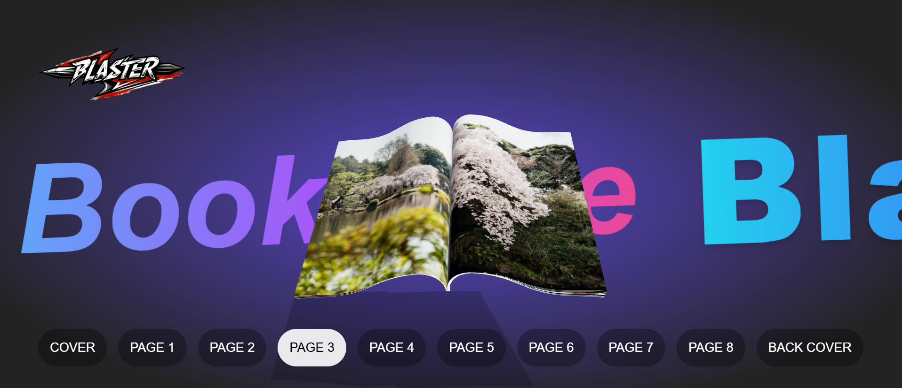

# 📚 BookGlide: Animated 3D Book Slider

> 🚀 An interactive **animated 3D book slider** built with **React, TailwindCSS, and Three.js**. Experience a visually stunning digital book with **smooth page-flipping effects** and glowing visuals ✨.

---

## 🌟 Key Features

The heart of **BookGlide** lies in its realistic 3D presentation and fluid interaction:

* 📖 **Interactive 3D Book:** Realistic rendering of a book object with distinct pages.
* 🎨 **Three.js Geometry:** Utilizes **BoxGeometry** from **Three.js** to construct a convincing 3D book shape.
* 🎬 **Smooth Page Flip:** Features beautifully animated transitions for an immersive flipping experience.
* ✨ **Stunning Visuals:** Enhanced with glowing effects and modern design aesthetics.
* ⚡ **Modern Stack:** Built on a robust foundation of **React, TailwindCSS, and Three.js**.

---

## 🛠️ Tech Stack

| Technology | Purpose |
| :--- | :--- |
| **⚛️ React.js** | The core library for building the user interface and managing components. |
| **🎨 TailwindCSS** | A utility-first CSS framework for rapid and modern styling. |
| **🌐 Three.js** | The powerful JavaScript library responsible for the **3D rendering** and book geometry. |
| **📦 Yarn** | Used for efficient package and dependency management. |

---

## 🚀 Installation & Setup

Get the **BookGlide** project running on your local machine in just a few steps.

1.  **Clone the repository:**
    ```bash
    git clone https://github.com/mukit-blaster/BookGlide.git
    ```
2.  **Navigate** to the project directory  with your actual folder name:
    ```bash
    cd BookGlide
    ```
3.  **Install dependencies** using Yarn:
    ```bash
    yarn install
    ```
4.  **Launch** the application in development mode:
    ```bash
    yarn dev
    ```

The application should now be available in your browser, typically at `http://localhost:3000`.

---

## 🎥 Preview




---

## 🌐 Live Demo

🔗 Click the link below to explore live preview:

* **[BookGlide Live Demo]** - `https://bookglide3d.vercel.app/`

---

## 🤝 Contributing

We welcome contributions to make **BookGlide** even more amazing! Whether it's fixing a bug, enhancing performance, or adding a cool new feature, your pull requests are highly appreciated.

If you'd like to improve **animations**, enhance **responsiveness** across different devices, refactor the code, or add **new features** (like different book styles, custom content mapping, etc.), please feel free to contribute.

---

## 📄 License

This project is licensed under the **MIT License**. See the `LICENSE.md` file for details.
